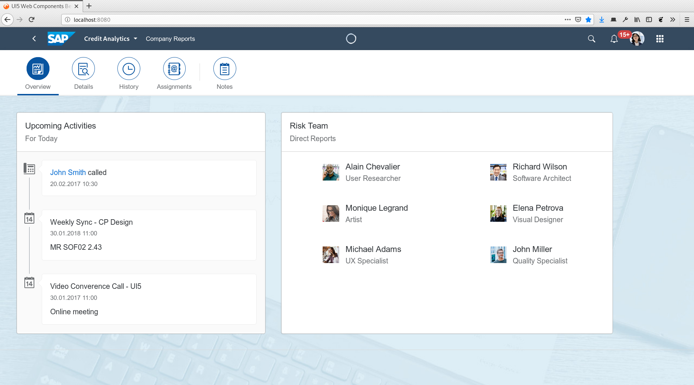
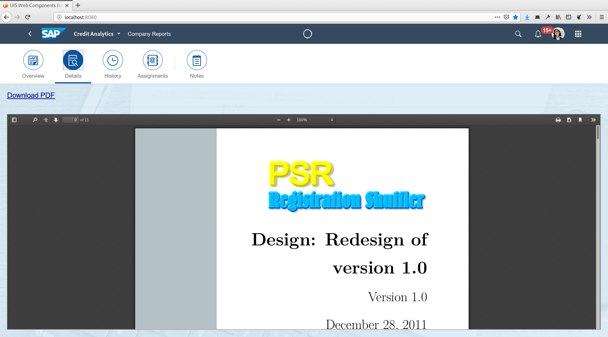
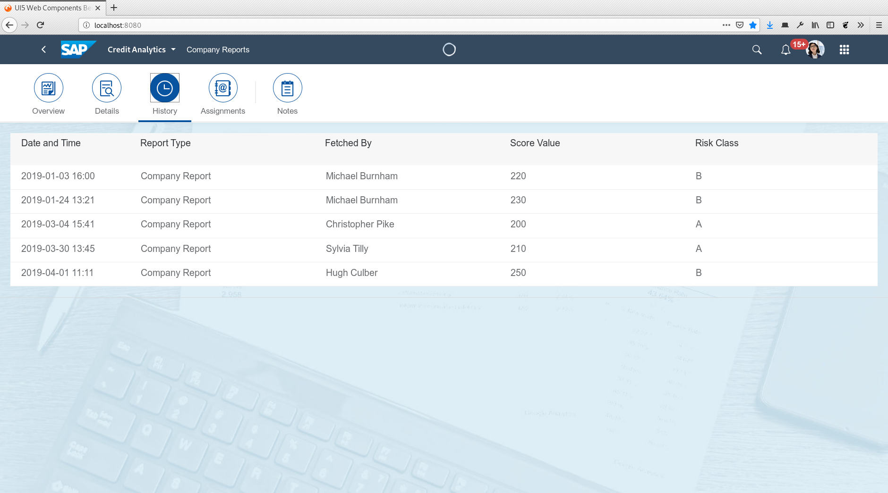
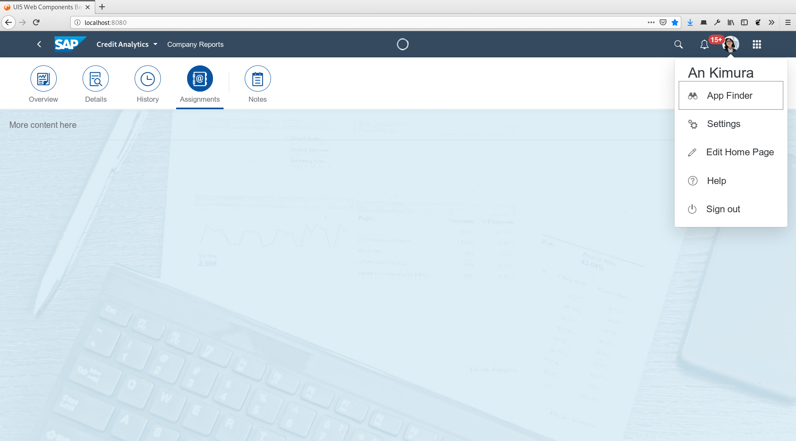

SAP UI5 Web Components Example
==============================

This is a quick and dirty “Hello, World!” example using SAP UI5 Web Components
and Webpack.

 * https://github.com/SAP/ui5-webcomponents/
 * https://sap.github.io/ui5-webcomponents/
 * http://webpack.js.org/

<table style="max-width: 100%;">
    <tr>
        <td>
            
        </td>
        <td>
            
        </td>
    </tr>
    <tr>
        <td>
            
        </td>
        <td>
            
        </td>
    </tr>
</table>

Getting Started
---------------

Use the following commands to run this example:

 * `npm clean` to remove all generated files
 * `npm build` to build a static version to deploy on a web server
 * `npm watch` to automatically rebuild when the sources change
 * `npm devserver` to start webpack`s built-in web server
 * `npm staticserver` to start an alternative more simple web server

Copyright
---------

To the extent possible under law, Dennis Schulmeister-Zimolong has waived all
copyright and related or neighboring rights to UI5 Web Components Beispiel.
This work is published from: Germany.
